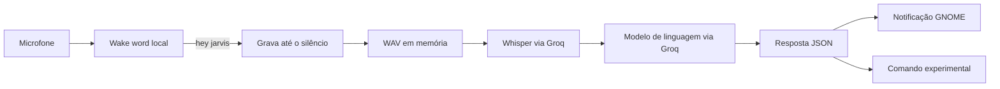

# GOATS AI

Assistente de voz local para Linux, construído em Python e pensado para o GNOME. O projeto, chamado **TuxAssist**, escuta a palavra de ativação **“hey jarvis”**, transcreve a fala em português, envia o pedido para um modelo de linguagem e pode executar ações no sistema.

> Projeto experimental em desenvolvimento. A execução de comandos ainda é simples e deve ser revisada antes de usar o assistente em uma máquina importante.

## O que ele faz

- Detecta a palavra de ativação com o modelo local `jasper.onnx`.
- Captura áudio do microfone com `sounddevice`.
- Detecta o fim da fala após um período de silêncio.
- Converte o áudio para WAV em memória.
- Transcreve o áudio em português com Whisper via Groq.
- Gera uma resposta estruturada em JSON usando um modelo da Groq.
- Exibe notificações no desktop com o ícone do Tux.
- Abre o Ptyxis ou o navegador quando o modelo retorna um comando compatível.

## Estrutura

```text
.
├── ai/
│   └── api.py              # Groq: transcrição e respostas
├── audio/
│   ├── record.py           # Captura e detecção de silêncio
│   └── wav.py              # Conversão do áudio para WAV
├── assets/
│   ├── tux.svg             # Ícone das notificações
│   └── tux.webp
├── system/
│   ├── commands.py         # Execução das ações do sistema
│   └── notify.py           # Notificações do GNOME
├── jasper.onnx             # Modelo local de wake word
├── main.py                 # Ponto de entrada
└── .env.example            # Modelo das variáveis de ambiente
```

## Requisitos

- Linux com microfone funcional.
- Python 3.10 ou mais recente.
- GNOME ou outro desktop com `notify-send`.
- Uma chave da API da Groq.
- PortAudio para o `sounddevice`.

No Arch Linux, CachyOS ou derivados:

```bash
sudo pacman -S --needed python portaudio libnotify
```

## Instalação

```bash
git clone https://github.com/amendoa657/tuxAssist.git
cd tuxAssist
python -m venv .venv
source .venv/bin/activate
python -m pip install --upgrade pip
python -m pip install numpy sounddevice openwakeword groq python-dotenv
```

## Configuração

```bash
cp .env.example .env
```

Edite `.env` e informe sua chave:

```env
GROQ_API_KEY=sua-chave-da-groq
```

O arquivo `.env` é ignorado pelo Git. Nunca coloque chaves reais no README, em commits ou em logs.

## Como o fluxo funciona



### 1. Escuta contínua

`main.py` abre um `InputStream` mono em 16 kHz e lê blocos de 1.280 amostras. O modelo `jasper.onnx`, carregado pelo `openwakeword`, analisa cada bloco. Quando a confiança passa de `0.5`, a escuta ativa é detectada.

### 2. Gravação até o silêncio

`audio/record.py` continua lendo o microfone depois da palavra-chave. O volume médio do bloco é comparado com `VOLUME_FALA = 300`. Depois que a pessoa começa a falar, 12 blocos silenciosos encerram a gravação — aproximadamente um segundo.

### 3. Conversão sem arquivo temporário

`audio/wav.py` transforma os samples em um WAV mono de 16 bits e 16 kHz usando `io.BytesIO`. O áudio é mantido em memória e enviado para a transcrição.

### 4. Transcrição e intenção

`ai/api.py` envia o áudio para `whisper-large-v3-turbo` com idioma português. O texto transcrito então é enviado ao modelo `openai/gpt-oss-20b`, com a instrução de responder em JSON:

```json
{
  "resposta": "A resposta que será exibida",
  "comando": "comando opcional do sistema"
}
```

Se existir `resposta`, ela vira uma notificação. Se existir `comando`, o projeto tenta executá-lo.

## Uso

```bash
source .venv/bin/activate
python main.py
```

Ao iniciar, o programa mostra:

```text
Diga 'hey jarvis'...
```

Diga a palavra de ativação, espere **“Pode falar!”** e faça um pedido em português. Para sair, use `Ctrl+C` no terminal.

## Segurança e estado atual

Este é um projeto experimental. O módulo `system/commands.py` possui uma implementação final de `executar()` que chama `subprocess.Popen([comando])` com o texto retornado pelo modelo. Isso significa que não há, no estado atual, uma lista rígida de comandos permitidos.

Antes de usar o assistente em uma máquina importante:

- não use credenciais ou dados sensíveis durante os testes;
- mantenha `.env` fora do Git;
- revise e restrinja `system/commands.py` a uma allowlist de ações;
- valide o JSON antes de acessar qualquer campo;
- registre e mostre o comando para confirmação antes de executá-lo;
- revogue uma chave de API imediatamente se ela for exposta.

## Solução de problemas

### Ver os dispositivos de áudio

```bash
python -c "import sounddevice as sd; print(sd.query_devices())"
```

### `PortAudio library not found`

```bash
sudo pacman -S portaudio
```

### Notificações não aparecem

```bash
command -v notify-send
sudo pacman -S libnotify
```

### O modelo de wake word não é encontrado

Execute o programa a partir da raiz do projeto e confirme que `jasper.onnx` está presente:

```bash
cd /caminho/para/TuxAssist
python main.py
```

## Próximos passos

- Criar uma allowlist segura de comandos.
- Adicionar confirmação antes de ações externas.
- Separar configuração, estado da conversa e integração com modelos.
- Adicionar respostas por voz.
- Criar testes para áudio, JSON e comandos.
- Adicionar uma licença ao projeto.

O README anterior foi preservado em [`README.before-showcase.md`](README.before-showcase.md).
