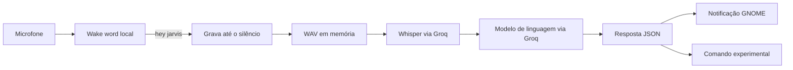

<div align="center">


# TuxAssist

### Um assistente de voz para Linux que transforma fala em ações.

<p>
  <a href="#o-fluxo">Fluxo</a> ·
  <a href="#instalação">Instalação</a> ·
  <a href="#segurança">Segurança</a> ·
  <a href="#próximos-passos">Próximos passos</a>
</p>

</div>

> **TuxAssist** é um experimento em Python para controlar tarefas no desktop Linux usando voz, com ativação local por palavra-chave, transcrição em português e notificações do GNOME.

O projeto é local na escuta e na orquestração, mas usa a **Groq** para transcrever o áudio e interpretar o pedido. A execução de comandos ainda é experimental e deve ser revisada antes de qualquer uso em uma máquina importante.

## O que ele faz

- Fica aguardando a palavra-chave **“hey jarvis”**.
- Detecta a ativação com o modelo local `jasper.onnx`.
- Grava a fala até identificar silêncio.
- Converte o áudio para WAV diretamente em memória.
- Transcreve português com `whisper-large-v3-turbo`.
- Pede ao modelo uma resposta estruturada em JSON.
- Mostra a resposta como notificação com o ícone do Tux.
- Pode disparar um comando retornado pelo modelo — recurso ainda não seguro.

## O fluxo



### 1. Escuta contínua

`main.py` abre um `InputStream` mono em 16 kHz e lê blocos de 1.280 amostras. O `openwakeword` analisa cada bloco usando `jasper.onnx`. Quando a maior confiança passa de `0.5`, o assistente entra no modo de gravação.

### 2. Gravação até o silêncio

`audio/record.py` mede o volume médio de cada bloco. Enquanto a pessoa fala, o contador de silêncio volta para zero. Depois que a fala começa, 12 blocos silenciosos encerram a captura — aproximadamente um segundo.

### 3. Áudio em memória

`audio/wav.py` empacota os samples como WAV mono de 16 bits e 16 kHz usando `io.BytesIO`. Assim, o áudio pode seguir direto para a API sem precisar criar um arquivo temporário.

### 4. Transcrição e intenção

`ai/api.py` envia o áudio para o Whisper com idioma português. O texto resultante é enviado ao modelo da Groq, que recebe a instrução de responder em JSON:

```json
{
  "resposta": "A resposta que será exibida",
  "comando": "comando opcional do sistema"
}
```

O campo `resposta` vira uma notificação. Se o campo `comando` existir, o código atual tenta executá-lo.

## Estrutura

```text
.
├── ai/
│   └── api.py              # Transcrição e respostas via Groq
├── audio/
│   ├── record.py           # Captura e detecção de silêncio
│   └── wav.py              # Conversão para WAV em memória
├── assets/
│   ├── tux.svg             # Ícone das notificações
│   └── tux.webp            # Identidade visual
├── system/
│   ├── commands.py         # Ações do sistema
│   └── notify.py           # Notificações do desktop
├── jasper.onnx             # Modelo local de wake word
├── main.py                 # Ponto de entrada
└── .env.example            # Modelo das variáveis de ambiente
```

## Requisitos

- Linux com microfone funcional.
- Python 3.10 ou mais recente.
- GNOME ou outro desktop com `notify-send`.
- Chave da API da Groq.
- PortAudio para o `sounddevice`.

No Arch Linux, CachyOS ou derivados:

```bash
sudo pacman -S --needed python portaudio libnotify
```

## Instalação

```bash
git clone https://github.com/amendoa657/tuxAssist.git
cd tuxAssist
python -m venv .venv
source .venv/bin/activate
python -m pip install --upgrade pip
python -m pip install numpy sounddevice openwakeword groq python-dotenv
```

## Configuração

Crie o arquivo local de ambiente:

```bash
cp .env.example .env
```

Depois, edite `.env`:

```env
GROQ_API_KEY=sua-chave-da-groq
```

O `.env` é ignorado pelo Git. Nunca publique chaves reais no README, em commits ou em logs. A variável `GEMINI_API_KEY` permanece no exemplo por compatibilidade futura, mas o código atual usa a Groq.

## Como executar

```bash
source .venv/bin/activate
python main.py
```

Quando aparecer:

```text
Diga 'hey jarvis'...
```

diga a palavra de ativação. Depois do aviso **“Pode falar!”**, faça seu pedido em português. Para sair, use `Ctrl+C` no terminal.

## Segurança

O projeto ainda está em fase experimental. A implementação final de `executar()` em `system/commands.py` chama `subprocess.Popen([comando])` com o texto retornado pelo modelo. Hoje não existe uma allowlist rígida de comandos.

Antes de usar o assistente em uma máquina importante:

- não use credenciais ou dados sensíveis durante os testes;
- mantenha o `.env` fora do Git;
- revise e restrinja `system/commands.py`;
- valide o JSON antes de usar seus campos;
- mostre o comando para confirmação antes de executá-lo;
- revogue uma chave de API imediatamente se ela for exposta.

## Solução de problemas

### Ver os dispositivos de áudio

```bash
python -c "import sounddevice as sd; print(sd.query_devices())"
```

### `PortAudio library not found`

```bash
sudo pacman -S portaudio
```

### Notificações não aparecem

```bash
command -v notify-send
sudo pacman -S libnotify
```

### O modelo de wake word não é encontrado

Execute o programa a partir da raiz e confirme que `jasper.onnx` está presente:

```bash
cd /caminho/para/TuxAssist
python main.py
```

## Próximos passos

- Criar uma allowlist segura de comandos.
- Adicionar confirmação antes de ações externas.
- Separar configuração, estado da conversa e integração com modelos.
- Adicionar respostas por voz.
- Criar testes para áudio, JSON e comandos.
- Adicionar uma licença ao projeto.

O README anterior foi preservado em [`README.before-showcase.md`](README.before-showcase.md).
